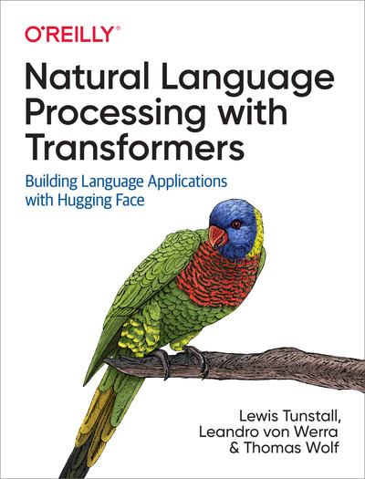

# Transformers Notebooks

This repository contains the example code from our O'Reilly book [Natural Language Processing with Transformers](https://www.oreilly.com/library/view/natural-language-processing/9781098136789/):



## Getting started

You can run these notebooks on cloud platforms like [Google Colab](https://colab.research.google.com/) or your local machine. Note that most chapters require a GPU to run in a reasonable amount of time, so we recommend one of the cloud platforms as they come pre-installed with CUDA.

### Running on a cloud platform

To run these notebooks on a cloud platform, just click on one of the badges in the table below:

<!--This table is automatically generated, do not fill manually!-->


| Chapter                                     | Colab                                                                                                                                                                                               | Kaggle                                                                                                                                                                                                   | Gradient                                                                                                                                                                               | Studio Lab                                                                                                                                                                                                   |
|:--------------------------------------------|:----------------------------------------------------------------------------------------------------------------------------------------------------------------------------------------------------|:---------------------------------------------------------------------------------------------------------------------------------------------------------------------------------------------------------|:---------------------------------------------------------------------------------------------------------------------------------------------------------------------------------------|:-------------------------------------------------------------------------------------------------------------------------------------------------------------------------------------------------------------|
| Introduction                                | [](https://colab.research.google.com/github/nlp-with-transformers/notebooks/blob/main/01_introduction.ipynb)              | [](https://kaggle.com/kernels/welcome?src=https://github.com/nlp-with-transformers/notebooks/blob/main/01_introduction.ipynb)              | [](https://console.paperspace.com/github/nlp-with-transformers/notebooks/blob/main/01_introduction.ipynb)              | [](https://studiolab.sagemaker.aws/import/github/nlp-with-transformers/notebooks/blob/main/01_introduction.ipynb)              |
| Text Classification                         | [](https://colab.research.google.com/github/nlp-with-transformers/notebooks/blob/main/02_classification.ipynb)            | [](https://kaggle.com/kernels/welcome?src=https://github.com/nlp-with-transformers/notebooks/blob/main/02_classification.ipynb)            | [](https://console.paperspace.com/github/nlp-with-transformers/notebooks/blob/main/02_classification.ipynb)            | [](https://studiolab.sagemaker.aws/import/github/nlp-with-transformers/notebooks/blob/main/02_classification.ipynb)            |
| Transformer Anatomy                         | [](https://colab.research.google.com/github/nlp-with-transformers/notebooks/blob/main/03_transformer-anatomy.ipynb)       | [](https://kaggle.com/kernels/welcome?src=https://github.com/nlp-with-transformers/notebooks/blob/main/03_transformer-anatomy.ipynb)       | [](https://console.paperspace.com/github/nlp-with-transformers/notebooks/blob/main/03_transformer-anatomy.ipynb)       | [](https://studiolab.sagemaker.aws/import/github/nlp-with-transformers/notebooks/blob/main/03_transformer-anatomy.ipynb)       |
| Multilingual Named Entity Recognition       | [](https://colab.research.google.com/github/nlp-with-transformers/notebooks/blob/main/04_multilingual-ner.ipynb)          | [](https://kaggle.com/kernels/welcome?src=https://github.com/nlp-with-transformers/notebooks/blob/main/04_multilingual-ner.ipynb)          | [](https://console.paperspace.com/github/nlp-with-transformers/notebooks/blob/main/04_multilingual-ner.ipynb)          | [](https://studiolab.sagemaker.aws/import/github/nlp-with-transformers/notebooks/blob/main/04_multilingual-ner.ipynb)          |
| Text Generation                             | [](https://colab.research.google.com/github/nlp-with-transformers/notebooks/blob/main/05_text-generation.ipynb)           | [](https://kaggle.com/kernels/welcome?src=https://github.com/nlp-with-transformers/notebooks/blob/main/05_text-generation.ipynb)           | [](https://console.paperspace.com/github/nlp-with-transformers/notebooks/blob/main/05_text-generation.ipynb)           | [](https://studiolab.sagemaker.aws/import/github/nlp-with-transformers/notebooks/blob/main/05_text-generation.ipynb)           |
| Summarization                               | [](https://colab.research.google.com/github/nlp-with-transformers/notebooks/blob/main/06_summarization.ipynb)             | [](https://kaggle.com/kernels/welcome?src=https://github.com/nlp-with-transformers/notebooks/blob/main/06_summarization.ipynb)             | [](https://console.paperspace.com/github/nlp-with-transformers/notebooks/blob/main/06_summarization.ipynb)             | [](https://studiolab.sagemaker.aws/import/github/nlp-with-transformers/notebooks/blob/main/06_summarization.ipynb)             |
| Question Answering                          | [](https://colab.research.google.com/github/nlp-with-transformers/notebooks/blob/main/07_question-answering.ipynb)        | [](https://kaggle.com/kernels/welcome?src=https://github.com/nlp-with-transformers/notebooks/blob/main/07_question-answering.ipynb)        | [](https://console.paperspace.com/github/nlp-with-transformers/notebooks/blob/main/07_question-answering.ipynb)        | [](https://studiolab.sagemaker.aws/import/github/nlp-with-transformers/notebooks/blob/main/07_question-answering.ipynb)        |
| Making Transformers Efficient in Production | [](https://colab.research.google.com/github/nlp-with-transformers/notebooks/blob/main/08_model-compression.ipynb)         | [](https://kaggle.com/kernels/welcome?src=https://github.com/nlp-with-transformers/notebooks/blob/main/08_model-compression.ipynb)         | [](https://console.paperspace.com/github/nlp-with-transformers/notebooks/blob/main/08_model-compression.ipynb)         | [](https://studiolab.sagemaker.aws/import/github/nlp-with-transformers/notebooks/blob/main/08_model-compression.ipynb)         |
| Dealing with Few to No Labels               | [](https://colab.research.google.com/github/nlp-with-transformers/notebooks/blob/main/09_few-to-no-labels.ipynb)          | [](https://kaggle.com/kernels/welcome?src=https://github.com/nlp-with-transformers/notebooks/blob/main/09_few-to-no-labels.ipynb)          | [](https://console.paperspace.com/github/nlp-with-transformers/notebooks/blob/main/09_few-to-no-labels.ipynb)          | [](https://studiolab.sagemaker.aws/import/github/nlp-with-transformers/notebooks/blob/main/09_few-to-no-labels.ipynb)          |
| Training Transformers from Scratch          | [](https://colab.research.google.com/github/nlp-with-transformers/notebooks/blob/main/10_transformers-from-scratch.ipynb) | [](https://kaggle.com/kernels/welcome?src=https://github.com/nlp-with-transformers/notebooks/blob/main/10_transformers-from-scratch.ipynb) | [](https://console.paperspace.com/github/nlp-with-transformers/notebooks/blob/main/10_transformers-from-scratch.ipynb) | [](https://studiolab.sagemaker.aws/import/github/nlp-with-transformers/notebooks/blob/main/10_transformers-from-scratch.ipynb) |
| Future Directions                           | [](https://colab.research.google.com/github/nlp-with-transformers/notebooks/blob/main/11_future-directions.ipynb)         | [](https://kaggle.com/kernels/welcome?src=https://github.com/nlp-with-transformers/notebooks/blob/main/11_future-directions.ipynb)         | [](https://console.paperspace.com/github/nlp-with-transformers/notebooks/blob/main/11_future-directions.ipynb)         | [](https://studiolab.sagemaker.aws/import/github/nlp-with-transformers/notebooks/blob/main/11_future-directions.ipynb)         |

<!--End of table-->

Nowadays, the GPUs on Colab tend to be K80s (which have limited memory), so we recommend using [Kaggle](https://www.kaggle.com/docs/notebooks), [Gradient](https://gradient.run/notebooks), or [SageMaker Studio Lab](https://studiolab.sagemaker.aws/). These platforms tend to provide more performant GPUs like P100s, all for free!

> Note: some cloud platforms like Kaggle require you to restart the notebook after installing new packages.

### Running on your machine

To run the notebooks on your own machine, first clone the repository and navigate to it:

```bash
$ git clone https://github.com/nlp-with-transformers/notebooks.git
$ cd notebooks
```

Next, run the following command to create a `conda` virtual environment that contains all the libraries needed to run the notebooks:

```bash
$ conda env create -f environment.yml
```

> Note: You'll need a GPU that supports NVIDIA's [CUDA Toolkit](https://developer.nvidia.com/cuda-toolkit) to build the environment. Currently, this means you cannot build locally on Apple silicon 😢.

Chapter 7 (Question Answering) has a special set of dependencies, so to run that chapter you'll need a separate environment:

```bash
$ conda env create -f environment-chapter7.yml
```

Once you've installed the dependencies, you can activate the `conda` environment and spin up the notebooks as follows:

```bash
$ conda activate book # or conda activate book-chapter7
$ jupyter notebook
```

## FAQ

### When trying to clone the notebooks on Kaggle I get a message that I am unable to access the book's Github repository. How can I solve this issue?

This issue is likely due to a missing internet connection. When running your first notebook on Kaggle you need to enable internet access in the settings menu on the right side. 

### How do you select a GPU on Kaggle?

You can enable GPU usage by selecting *GPU* as *Accelerator* in the settings menu on the right side.

## Citations

If you'd like to cite this book, you can use the following BibTeX entry:

```
@book{tunstall2022natural,
  title={Natural Language Processing with Transformers: Building Language Applications with Hugging Face},
  author={Tunstall, Lewis and von Werra, Leandro and Wolf, Thomas},
  isbn={1098103246},
  url={https://books.google.ch/books?id=7hhyzgEACAAJ},
  year={2022},
  publisher={O'Reilly Media, Incorporated}
}
```
