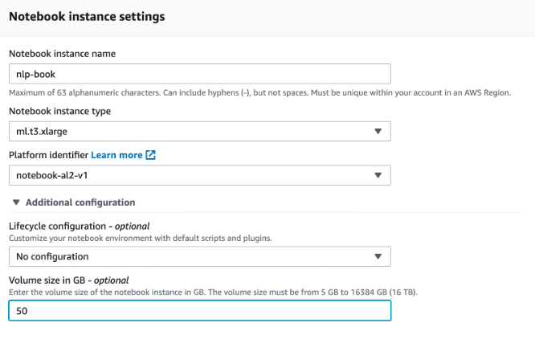
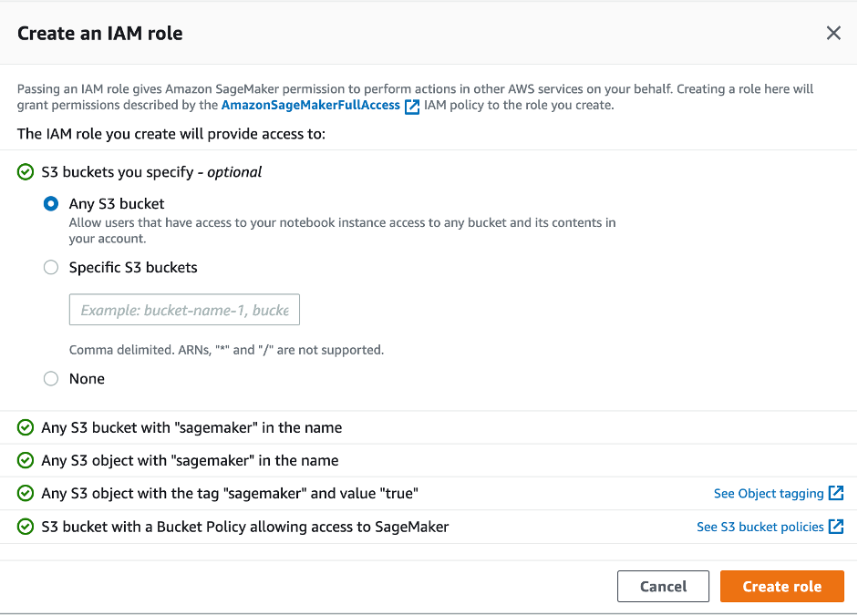
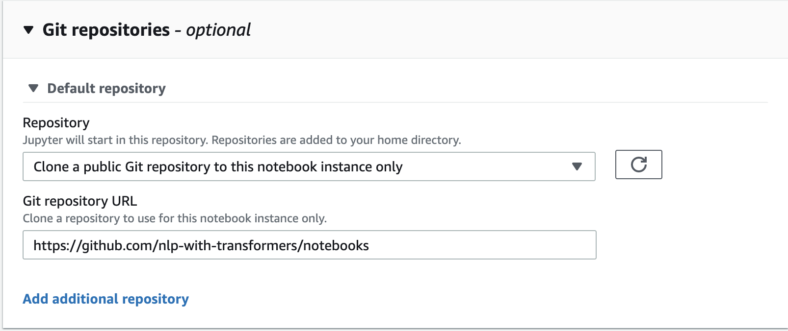

# Run the Hugging Face notebooks on SageMaker 

1/
Open Amazon SageMaker Notebook Instances in your preferred AWS region:
https://console.aws.amazon.com/sagemaker/home#/notebook-instances 

2/
Click **Create notebook instance**.

3/
**Choose an instance type:**
Any ml.t3.* instance or if you want to have an instance with GPU take e.g. ml.g4dn.xlarge. \
Overview: https://aws.amazon.com/sagemaker/pricing/

4/
Choose **notebook-al2-v1** and add more storage volume, e.g. 50 GB.

5/ (optional)
If you plan to use JupyterLab, make sure to add a Lifecycle configuration with the following code.
Or execute the code in a terminal in JupyterLab.

`
sudo -u ec2-user -i <<'EOF'
EXTENSION_NAME=@jupyter-widgets/jupyterlab-manager 
source /home/ec2-user/anaconda3/bin/activate JupyterSystemEnv
jupyter labextension install $EXTENSION_NAME
source /home/ec2-user/anaconda3/bin/deactivate
EOF
`

5/
Create a new IAM role, which will used in the notebooks to access AWS resources.

6/
Add this Git repository, which will be cloned to your notebook by selecting *Clone a public Git repository to this notebook instance only*.
Paste the Git repository URL to the next field.

7/
The notebook instance will now created and after you click **Open Jupyter** you see the cloned notebooks. 
Navigate to the folder *SageMaker*, open the first chapter and execute one cell after the other.